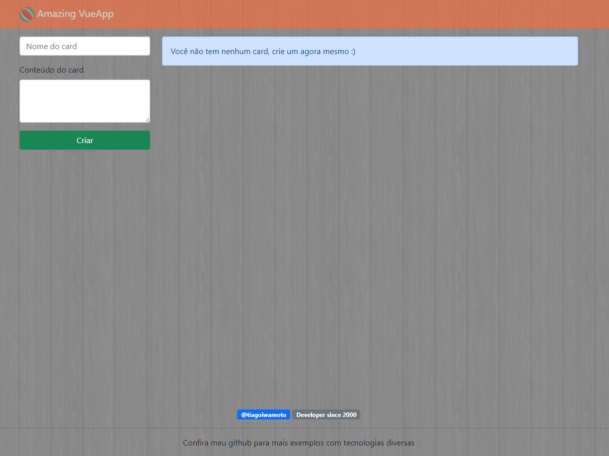
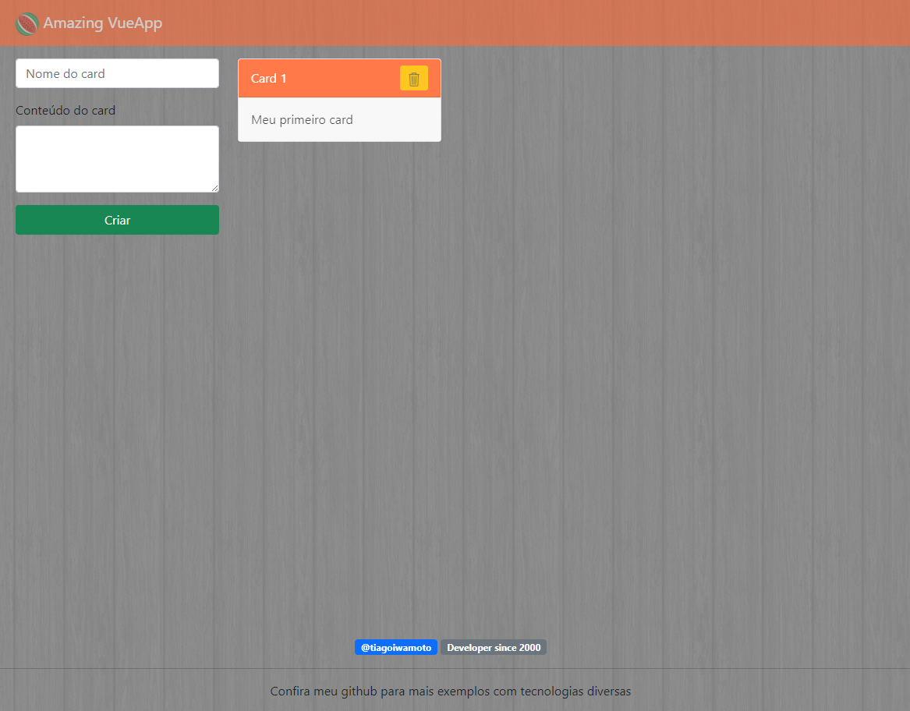
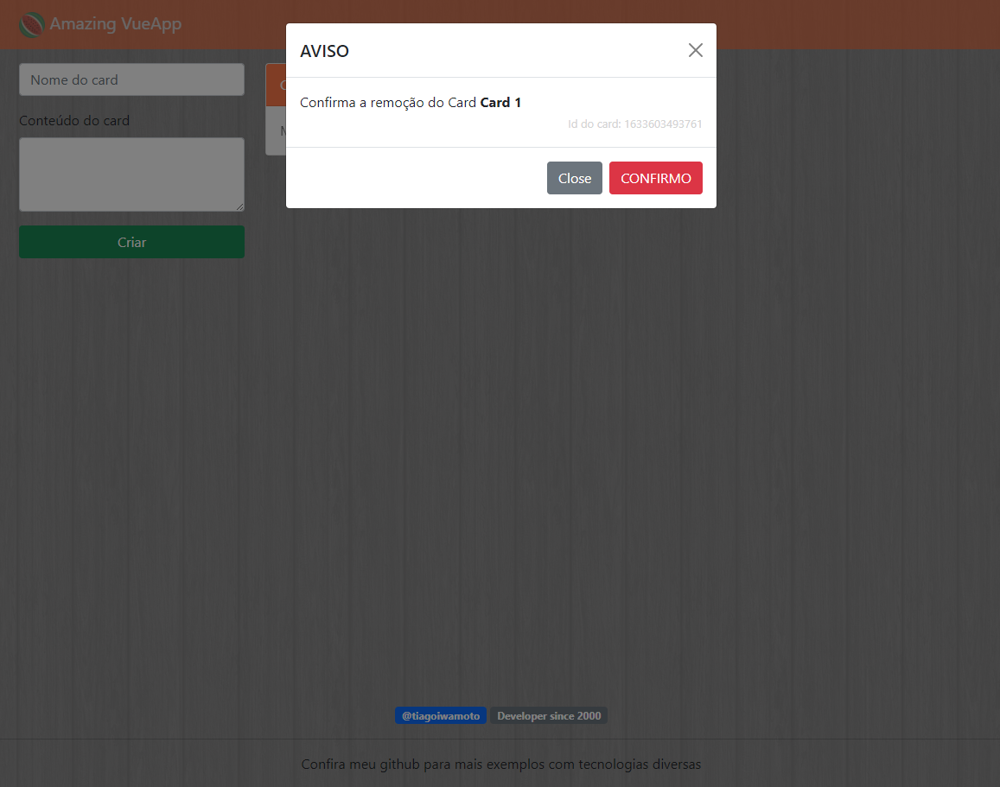

# Amazing VueJs App
Simples aplicação em VueApp
## Objetivo
> Mostrar as principais funcionalidades do Vuejs 3.x e utilização do Bootstrap. Esta aplicação utiliza o localStorage do navegador para gravar os cards gerados e por este motivo mesmo você fechando o navegador os dados não são perdidos, apenas se você limpar os dados temporários do seu navegador.
## Tecnologias
    Vuejs 3.x
    Bootstrap 5.x
    Axios (Para futuras implementações)

## Demo
>Aplicação publicada na AWS http://iwt-vueapp.meajudatintin.cf/iwt-amazing-vueapp/

## Screenshots

## Sobre min
> Desenvolvedor curioso desde 2000 e profissionalmente desde 2008 sou um amante da tecnologia e sempre estou atrás de novidades. Amo minha profissão.

## Fale comigo
> Linkedin: https://www.linkedin.com/in/tiago-iwamoto/